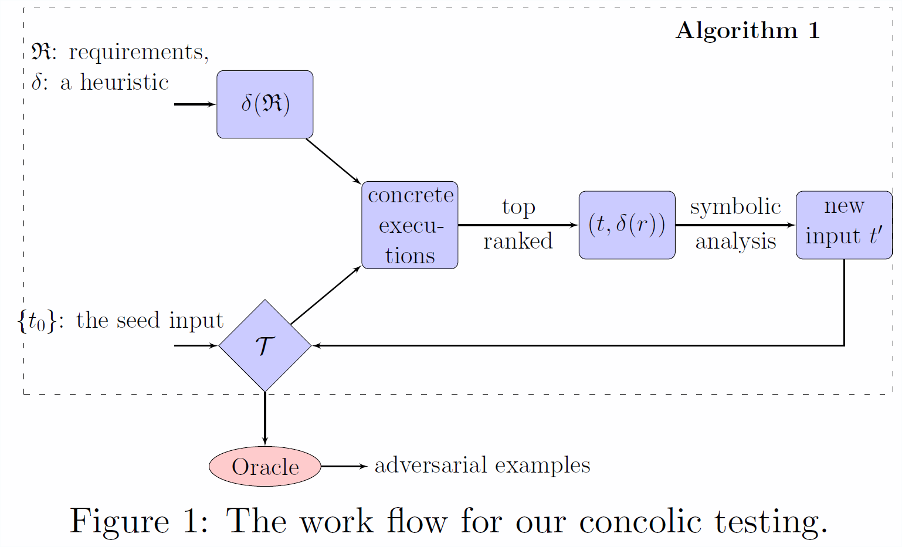

# DeepConcolic (Concolic Testing for Deep Neural Networks)

Concolic testing alternates between CONCrete program execution and symbOLIC analysis to explore the execution paths of a software program and to increase code coverage. In this paper, we develop the first concolic testing approach for Deep Neural Networks (DNNs). More specifically, we utilise quantified linear arithmetic over rationals to express test requirements that have been studied in the literature, and then develop a coherent method to perform concolic testing with the aim of better coverage. Our experimental results show the effectiveness of the concolic testing approach in both achieving high coverage and finding adversarial examples.

# Work Flow


# Sample Results


# Run

```
usage: deepconcolic.py [-h] [--model MODEL] [--inputs DIR] [--outputs DIR]
                       [--criterion nc, bc, ssc...] [--mnist-dataset]
                       [--cifar10-dataset] [--vgg16-model] [--norm linf, l0]
                       [--input-rows] [--input-cols] [--input-channels]

The concolic testing for neural networks

optional arguments:
  -h, --help            show this help message and exit
  --model MODEL         The input neural network model (.h5)
  --inputs DIR          the input test data directory
  --outputs DIR         the outputput test data directory
  --criterion nc, bc, ssc...
                        the test criterion
  --mnist-dataset       MNIST dataset
  --cifar10-dataset     CIFAR10 dataset
  --vgg16-model         vgg16 model
  --norm linf, l0       the norm metric
  --input-rows          input rows
  --input-cols          input cols
  --input-channels      input channels

```

The neural network model under tested is specified by ``--model`` and a set of raw test data should be given
by using ``--inputs``. Some popular datasets like MNIST and CIFAR10 can be directly specified by using
``--mnist-dataset`` and ``--cifar10-dataset`` directly. ``--criterion`` is used to choose the coverage 
criterion and ``--norm`` helps select the norm metric to measure the distance between inputs. Some examples
to run DeepConcolic are in the following.

To run an MNIST model

```
python deepconcolic.py --model ../saved_models/mnist_complicated.h5 --mnist-data --outputs outs/
```

To run an CIFAR10 model

```
python deepconcolic.py --model ../saved_models/cifar10_complicated.h5 --cifar10-data --outputs outs/
```

To run MC/DC for DNNs on the CIFAR-10 model

```
 python deepconcolic.py --model ../saved_models/cifar10_complicated.h5 --criterion ssc --cond-ratio 0.1 --cifar10-data --outputs outs
```

To run MC/DC for DNNs on the VGG16 model

```
python  deepconcolic.py --vgg16-model --inputs data/ --outputs outs --cond-ratio 0.1 --top-classes 5 --labels labels.txt --criterion ssc
```

### Concolic Testing on Lipschitz Constants for DNNs

To run Lipschitz Constant Testing, please refer to instructions in folder "Lipschitz Constant Testing".

# Dependencies
We suggest create an environment using `conda`, `tensorflow>=1.5.0`
```
conda create --name deepconcolic
source activate deepconcolic
conda install keras
conda install opencv 
conda install pillow
pip install adversarial-robustness-toolbox
```
The linear programming engine uses [CPLEX](https://www.ibm.com/support/knowledgecenter/SSSA5P_12.7.0/ilog.odms.cplex.help/CPLEX/GettingStarted/topics/set_up/setup_overview.html)

# Publications

```
@inproceedings{swrhkk2018,
  AUTHOR    = { Sun, Youcheng
                and Wu, Min
                and Ruan, Wenjie
                and Huang, Xiaowei
                and Kwiatkowska, Marta
                and Kroening, Daniel },
  TITLE     = { Concolic Testing for Deep Neural Networks },
  BOOKTITLE = { Automated Software Engineering (ASE) },
  PUBLISHER = { ACM },
  PAGES     = { 109--119 },
  ISBN      = { 978-1-4503-5937-5 },
  YEAR      = { 2018 }
}
```
```
@article{sun2018testing,
  AUTHOR    = { Sun, Youcheng
                and Huang, Xiaowei
                and Kroening, Daniel },
  TITLE     = { Testing Deep Neural Networks },
  JOURNAL   = { arXiv preprint arXiv:1803.04792 },
  YEAR      = { 2018 }
}
```
